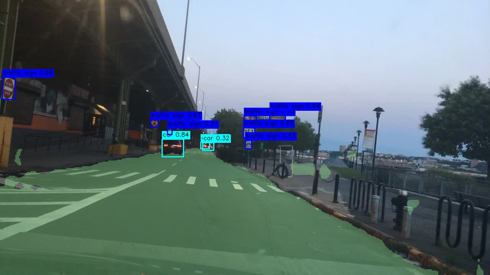

# Pure Vision ADAS Perception v0

基于 BDD100K 的纯视觉 ADAS 感知 baseline：使用 YOLOv8n 完成交通目标检测，使用轻量 BiSeNetV2-style 语义分割模型提取道路/可行驶区域，并将两类结果融合到同一帧图像中展示。

当前 v0 版本重点是跑通完整工程链路：

- BDD100K detection 标注转 YOLO 格式
- YOLOv8n 交通目标检测训练与评估
- BDD100K semantic segmentation 训练轻量分割 baseline
- 将 road 类作为可行驶区域近似，以浅绿色半透明 mask 叠加在道路上
- 将 YOLO 检测框叠加到同一张图中，形成 ADAS 感知可视化结果

后续计划加入 ONNX/TensorRT 导出，并迁移到 Jetson 平台进行端侧部署测试。

## Demo

以下示例展示了道路区域分割 overlay 与交通目标检测框的联合可视化效果。



更多 demo 图片见：

```text
assets/demo/
```

## Application

本项目面向以下方向：

- ADAS 视觉感知
- 自动驾驶 camera-only 感知 baseline
- 交通目标检测
- 可行驶区域/道路区域分割
- 边缘设备视觉模型部署
- ONNX/TensorRT 推理优化实验

在辅助驾驶场景中，目标检测用于识别驾驶员和系统需要关注的交通参与者与交通设施，例如车辆、行人、骑行者、交通灯、交通标志。道路/可行驶区域分割用于理解当前图像中的道路空间，为后续路径规划、车道保持、道路边界判断提供视觉基础。

本项目目前不是完整自动驾驶系统，而是一个纯视觉 ADAS 感知模块 v0。

## Method

项目包含两个分支。

### 1. Traffic Object Detection

检测模型：

```text
YOLOv8n
```

检测类别：

```text
person
rider
car
truck
bus
train
motor
bike
traffic light
traffic sign
```

BDD100K 原始检测标注是 JSON 格式，其中检测框字段为：

```json
"box2d": {
  "x1": ...,
  "y1": ...,
  "x2": ...,
  "y2": ...
}
```

本项目将其转换为 YOLO 格式：

```text
class_id x_center y_center width height
```

所有坐标均归一化到 0 到 1。

### 2. Road / Drivable Area Segmentation

分割模型：

```text
Lite BiSeNetV2-style
```

输入尺寸：

```text
512 x 288
```

类别数：

```text
19 classes
ignore_index = 255
```

当前版本使用 BDD100K semantic segmentation 标签训练 19 类语义分割模型，并在可视化阶段提取：

```text
road class
```

作为可行驶道路区域的近似。

注意：当前 v0 不是官方 drivable area 三分类任务。后续版本会使用 BDD100K drivable area labels 训练：

```text
background
direct drivable
alternative drivable
```

从而得到更严格的可行驶区域分割结果。

### 3. Fusion Visualization

联合可视化流程：

```text
Input image
  -> YOLOv8n detection
  -> Lite BiSeNetV2-style segmentation
  -> extract road mask
  -> blend light-green transparent road overlay
  -> draw YOLO boxes
  -> save fused ADAS visualization
```

最终效果：

- 浅绿色半透明区域：道路/可行驶区域近似
- 检测框：车辆、行人、骑行者、交通灯、交通标志等

## Results

### Detection Baseline

| Model | Dataset | Input | Epochs | Precision | Recall | mAP50 | mAP50-95 |
|---|---|---:|---:|---:|---:|---:|---:|
| YOLOv8n | BDD100K Detection | 640 | 20 | 0.666 | 0.396 | 0.433 | 0.237 |

Per-class mAP50:

| Class | mAP50 | mAP50-95 |
|---|---:|---:|
| car | 0.728 | 0.439 |
| traffic sign | 0.553 | 0.275 |
| traffic light | 0.528 | 0.183 |
| truck | 0.557 | 0.394 |
| bus | 0.524 | 0.400 |
| person | 0.507 | 0.235 |
| rider | 0.314 | 0.157 |
| bike | 0.314 | 0.147 |
| motor | 0.305 | 0.137 |
| train | 0.000 | 0.000 |

### Segmentation Baseline

| Model | Dataset | Input | Epochs | mIoU | Pixel Accuracy |
|---|---|---:|---:|---:|---:|
| Lite BiSeNetV2-style | BDD100K Semantic Segmentation | 512x288 | 20 | 0.3040 | 0.8674 |

## Repository Structure

```text
pure-vision-adas-perception/
  README.md
  requirements.txt
  .gitignore

  scripts/
    convert_bdd100k_to_yolo.py
    train_bdd_bisenetv2.py
    fusion_visualize_bdd.py

  configs/
    bdd100k_yolo_wsl.yaml.example

  docs/
    experiment_results.md

  assets/
    demo/
```

## Environment Setup

The following setup was tested on:

```text
WSL2 Ubuntu
Python 3.10
NVIDIA GeForce RTX 5070 Ti
PyTorch 2.11.0 + CUDA 12.8
Ultralytics 8.4.57
```

### Step 1: Create Conda Environment

```bash
conda create -n bddseg python=3.10 -y
conda activate bddseg
```

To avoid Python loading user-level packages from `~/.local`, run:

```bash
export PYTHONNOUSERSITE=1
```

You can also add it to your shell session before training.

### Step 2: Install PyTorch

For RTX 50 series / Blackwell GPUs, CUDA 12.8 PyTorch is recommended:

```bash
pip install torch torchvision torchaudio --index-url https://download.pytorch.org/whl/cu128
```

For other GPUs, select the correct install command from the official PyTorch website:

```text
https://pytorch.org/get-started/locally/
```

Verify GPU:

```bash
python -c "import torch; print(torch.__version__, torch.version.cuda, torch.cuda.is_available()); print(torch.cuda.get_device_name(0))"
```

Expected example:

```text
2.11.0+cu128 12.8 True
NVIDIA GeForce RTX 5070 Ti
```

### Step 3: Install Python Dependencies

```bash
pip install -r requirements.txt
```

If OpenCV or NumPy compatibility issues occur, the tested versions are:

```bash
pip install opencv-python==4.8.1.78 numpy==1.26.4 --force-reinstall
```

### Step 4: Install Ultralytics

If it was not installed from `requirements.txt`, run:

```bash
pip install ultralytics==8.4.57
```

Verify:

```bash
python -c "import ultralytics; print(ultralytics.__version__)"
```

## Dataset Preparation

This project uses BDD100K.

Download from:

```text
https://bdd-data.berkeley.edu/
```

For v0, two dataset parts are used:

```text
BDD100K detection labels/images
BDD100K semantic segmentation labels/images
```

Expected local structure:

```text
/path/to/projectbdd/
  archive/
    train/
      images/
      annotations/
    val/
      images/
      annotations/

  archivemask/
    images/
      train/
      val/
    labels/
      train/
      val/
```

In this project, example WSL paths were:

```text
/mnt/e/projectbdd/archive
/mnt/e/projectbdd/archivemask
```

Data is not included in this repository.

## Convert BDD100K Detection Labels to YOLO Format

Run:

```bash
python scripts/convert_bdd100k_to_yolo.py \
  --archive-root /mnt/e/projectbdd/archive
```

This creates:

```text
/mnt/e/projectbdd/archive/train/labels
/mnt/e/projectbdd/archive/val/labels
/mnt/e/projectbdd/archive/bdd100k_yolo.yaml
```

For WSL, make sure the YAML uses Linux paths:

```yaml
path: /mnt/e/projectbdd/archive
train: train/images
val: val/images
```

You can use:

```bash
cp configs/bdd100k_yolo_wsl.yaml.example /mnt/e/projectbdd/archive/bdd100k_yolo_wsl.yaml
```

Then edit:

```yaml
path: /mnt/e/projectbdd/archive
```

## Train YOLOv8n Detection Baseline

Download `yolov8n.pt` manually if automatic download fails.

Recommended location:

```text
/mnt/e/projectbdd/pretrained/yolov8n.pt
```

Smoke test:

```bash
yolo detect train \
  model=/mnt/e/projectbdd/pretrained/yolov8n.pt \
  data=/mnt/e/projectbdd/archive/bdd100k_yolo_wsl.yaml \
  imgsz=640 \
  epochs=1 \
  batch=8 \
  workers=4 \
  project=/mnt/e/projectbdd/yolo_runs \
  name=smoke_yolov8n \
  exist_ok=True
```

Full baseline:

```bash
yolo detect train \
  model=/mnt/e/projectbdd/pretrained/yolov8n.pt \
  data=/mnt/e/projectbdd/archive/bdd100k_yolo_wsl.yaml \
  imgsz=640 \
  epochs=20 \
  batch=16 \
  workers=4 \
  project=/mnt/e/projectbdd/yolo_runs \
  name=yolov8n_bdd100k_640
```

If GPU memory is insufficient, reduce:

```bash
batch=8
```

Main output:

```text
/mnt/e/projectbdd/yolo_runs/yolov8n_bdd100k_640/weights/best.pt
```

## Train Lite BiSeNetV2-style Segmentation Baseline

Smoke test:

```bash
python scripts/train_bdd_bisenetv2.py \
  --data-root /mnt/e/projectbdd/archivemask \
  --output-dir /mnt/e/projectbdd/bdd_bisenetv2_runs/smoke \
  --epochs 1 \
  --batch-size 4 \
  --train-limit 64 \
  --val-limit 32
```

Full baseline:

```bash
python scripts/train_bdd_bisenetv2.py \
  --data-root /mnt/e/projectbdd/archivemask \
  --output-dir /mnt/e/projectbdd/bdd_bisenetv2_runs/baseline_512x288 \
  --epochs 20 \
  --batch-size 8 \
  --width 512 \
  --height 288
```

Main output:

```text
/mnt/e/projectbdd/bdd_bisenetv2_runs/baseline_512x288/best.pt
```

## Run Fusion Visualization

After training both models, run:

```bash
python scripts/fusion_visualize_bdd.py \
  --source /mnt/e/projectbdd/archive/val/images \
  --seg-ckpt /mnt/e/projectbdd/bdd_bisenetv2_runs/baseline_512x288/best.pt \
  --yolo-ckpt /mnt/e/projectbdd/yolo_runs/yolov8n_bdd100k_640/weights/best.pt \
  --out-dir /mnt/e/projectbdd/fusion_results/val_20 \
  --limit 20 \
  --conf 0.25 \
  --alpha 0.35
```

Output:

```text
/mnt/e/projectbdd/fusion_results/val_20
```

Visualization meaning:

```text
light green transparent mask = predicted road area
boxes = YOLO traffic object detections
```

## Weights

Model weights are not included in this repository because GitHub is not suitable for storing large training artifacts.

Recommended options:

- GitHub Releases
- Hugging Face
- Google Drive
- Baidu Netdisk

Expected local paths:

```text
weights/yolov8n_bdd100k_best.pt
weights/bisenetv2_bdd100k_best.pt
```

## ONNX and Jetson Deployment Plan

Future versions will add:

- YOLOv8n export to ONNX
- segmentation model export to ONNX
- ONNXRuntime correctness check
- TensorRT FP16 engine generation
- TensorRT INT8 calibration if calibration data is available
- Jetson Orin / Jetson Nano deployment notes
- batch=1 latency benchmark
- FPS and memory usage report

Planned deployment chain:

```text
PyTorch checkpoint
  -> ONNX
  -> ONNXRuntime validation
  -> TensorRT FP16
  -> TensorRT INT8
  -> Jetson benchmark
```

The key metrics to report later:

```text
mAP
mIoU
model size
latency
FPS
GPU memory usage
```

## Limitations

Current v0 has several limitations:

- The segmentation branch uses semantic `road` class as a drivable-area approximation.
- It is not yet trained on official BDD100K drivable area three-class masks.
- YOLOv8n is lightweight, so small traffic lights and distant objects are still challenging.
- No ONNX/TensorRT export is included in v0.
- No Jetson benchmark is included in v0.

## Roadmap

- [x] Convert BDD100K detection labels to YOLO format
- [x] Train YOLOv8n detection baseline
- [x] Train lightweight segmentation baseline
- [x] Implement fusion visualization
- [ ] Train on official BDD100K drivable area masks
- [ ] Export detection model to ONNX
- [ ] Export segmentation model to ONNX
- [ ] TensorRT FP16 benchmark
- [ ] TensorRT INT8 benchmark
- [ ] Jetson deployment guide

## Resume Description

Example project description:

```text
Built a pure-vision ADAS perception baseline on BDD100K, including YOLOv8n traffic object detection and a lightweight BiSeNetV2-style semantic segmentation model. The detection branch achieved mAP50 0.433 and mAP50-95 0.237 on BDD100K validation, while the segmentation branch achieved mIoU 0.304 and pixel accuracy 0.867. Implemented a fusion visualization pipeline that overlays road-area segmentation masks and traffic-object bounding boxes in the same driving scene frame. Future work includes ONNX/TensorRT export and Jetson deployment.
```

## License

This repository is for learning and research purposes. Please follow the original license and terms of use of BDD100K and all third-party dependencies.
